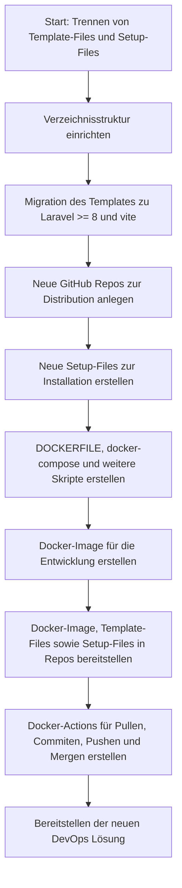

# CD-CI-Laravel-Vue-DevTemplate

```mermaid
---
config:
  layout: dagre
---
flowchart TD
    A["Start: Trennen von Template-Files und Setup-Files"] --> B["Verzeichnisstruktur einrichten"]
    B --> C["Migration des Templates zu Laravel &gt;= 8 und vite"]
    C --> D["Neue GitHub Repos zur Distribution anlegen"]
    D --> E["Neue Setup-Files zur Installation erstellen"]
    E --> F["DOCKERFILE, docker-compose und weitere Skripte erstellen"]
    F --> G["Docker-Image für die Entwicklung erstellen"]
    G --> H["Docker-Image, Template-Files sowie Setup-Files in Repos bereitstellen"]
    H --> I["Docker-Actions für Pullen, Commiten, Pushen und Mergen erstellen"]
    I --> J["Bereitstellen der neuen DevOps Lösung"]
```
